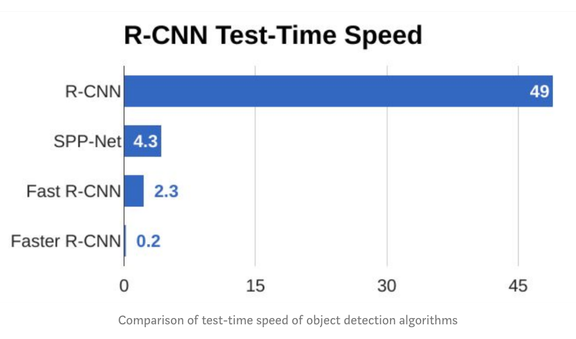

# Faster-RCNN

## Background

### R-CNN
> "Rich feature hierarchies for accurate object detection and semantic segmentation" by UC Berkely

The problem the R-CNN system tries to solve it is to locate objects in an image (object detection). The major steps within R-CNN are listed as follows.
1. generating region proposals via the selective search method
2. obtaining feature vectors using pre-trained CNN (e.g. ResNet)
3. classifying feature vectors with SVMs
4. improving bounding boxes using regression


#### region proposal

Rather than using sliding windows approach, which produces a very large number of image patches, region proposal algorithms are preferred. These algorithms take an image as the input and output bounding boxes corresponding to all patches in an image that are most likely to be objects. The region proposals can be noisy, overlapping and may not contain the object perfectly and these proposals are then classified using object recognition model. The region proposals with the high probability scores are locations of the object.

Region proposal algorithms work by grouping pixels into a smaller number of segments. An important property of a region proposal method is to have a high **recall**. It is important for region proposal algorithms to produce a lot of *false positives* as long as it catches all the *true positives*.

Several region proposal algorithms have been proposed:
1. objectness
2. constrained parametric min-cuts for automatic object segmentation
3. category independent object proposals
4. randomized prim
5. selective search

**Selective search** is a region proposal algorithm used in object detection. It is designed to be fast with a very high **recall**. It is based on computing hierarchical grouping of similar regions based on color, texture, size and shape compatibility. Selective search algorithm takes these oversegments as initial input and performs the following steps:
1. add all bounding boxes corresponding to segmented parts to the list of region proposals
2. group adjacent segments based on similarity (color/texture/size/shape)
3. go to step 1

#### CNN

Each region proposal are represented with a feature vector in a much smaller dimension using a Convolutional Neural Network (CNN). AlexNet, VGG, ResNet, Inception will do that. This is a fundamental issue within this R-CNN system that cannot train the whole system in one go, but rather train every part independently. 

Another important thing to keep in mind is that the input to the CNN is always the same while the image proposals have different shapes. Resizing every region proposal is a must.

#### SVM

SVM is used to detect what class of object those feature vectors represent. One SVM for one object class and then we have one feature vector as input and *n* outputs. The outputs are confidence scores: how confident we are that this particular feature vector represents the class.

When image proposals along with labels are produced, greedy non-maximum suppression is used: We reject a region (image proposal) if it has an intersection-over-union (IoU) overlap with a higher scoring selected region.

#### bounding box

Training a bounding box regressor helps improve the average precision. The inputs are the center, width and height of teh region proposal, and the label is the ground-truth bounding box. The goal is to learn a transformation that maps a proposed box P to a ground-truth box G.

#### problem with R-CNN

1. It still takes a huge amount of time to train the network as you would have to classify 2000 region proposals per image.
2. It cannot be implemented real-time as it takes around 47s for each test image.
3. The selective search algorithm is a fixed algorithm. Therefore, no learning is happening at that stage. This could lead to the generation of bad candidate region proposal.

#### Fast R-CNN

Fast R-CNN is similar to the R-CNN algorithm. Instead of feeding the region proposals to the CNN, we feed the input image to the CNN to generate a **convolutional feature map**. From the convolutional feature map, we identify the region of proposals and warp them into squares and by using a **RoI pooling layer** we reshape into into a fixed size in order to feed into a fully connected layer. From the RoI feature vector, we use a softmax layer to predict the class of the proposed region and also the offset values for the bounding box. 

The reason "Fast R-CNN" is faster than "R-CNN" is because you do not need to feed 2000 region proposals to the convolutional neural network every time. Instead, the convolution operation is done only once per image and a feature map is generated from it.


### Faster R-CNN

Both R-CNN and Fast R-CNN algorithms use selective search to localize the region proposals. Selective search is a low and time-consuming process affecting the performance of the network. (also non-learnable?) Therefore, it is replaced with a separate network, called **Region Proposal Network (RPN)**, to predict the region proposals. Note that this CNN is shared with the detection network, seen in "Sharing Features for RPN and Fast R-CNN".

The predicted region proposals are then reshaped using a RoI pooling layer which is then used to classify the image within the proposed region and predict the offset values for the bounding boxes. 


Faster R-CNN is much faster than its predecessors, and it could even be used for real-time object detection.



## USAGE:

As seen in ```main.py```, the functions of Faster R-CNN has been encapsulated into class ```FasterRCNN``` in module ```frcnn```. 

```
fast = FasterRCNN()
fast.load_data_train()
fast.build()
fast.train()
```
to load dataset, build the model and run the training according to the configuration file.

```
fast = FasterRCNN()
fast.test(<IMAGE_DIR>)
```
to evaluate the pre-trained model on specified test images.

Note that all the configuration is stored in the ```config.json``` and could be adjusted accordingly.

## STRUCTURE:

```
frcnn
|___ cnn
|   |___ vgg16.py
|   |___ vgg19.py
|   |___ resnet50.py
|   |___ xception.py (in development)
|   `___ inception_resnet.py (in development)
|___ utils
|   |___ config.py
|   |___ data_augment.py
|   |___ data_generators.py
|   |___ parser_pascal.py
|   `___ parser_simple.py
|___ fixed_batchnorm.py
|___ losses.py
|___ model.py
|___ roi_helpers.py
`___ roi_pooling.py
```

## EXAMPLE:

| origin | bounding box |
| :----: | :----------: |
|  |  |
|  |  |
|  |  |

## REFERENCE:
* [Faster R-CNN: Towards Real-Time Object Detection with Region Proposal Networks, 2015](https://arxiv.org/pdf/1506.01497.pdf)
* [Keras-FasterRCNN](https://github.com/you359/Keras-FasterRCNN)
* [keras-frcnn](https://github.com/yhenon/keras-frcnn/)